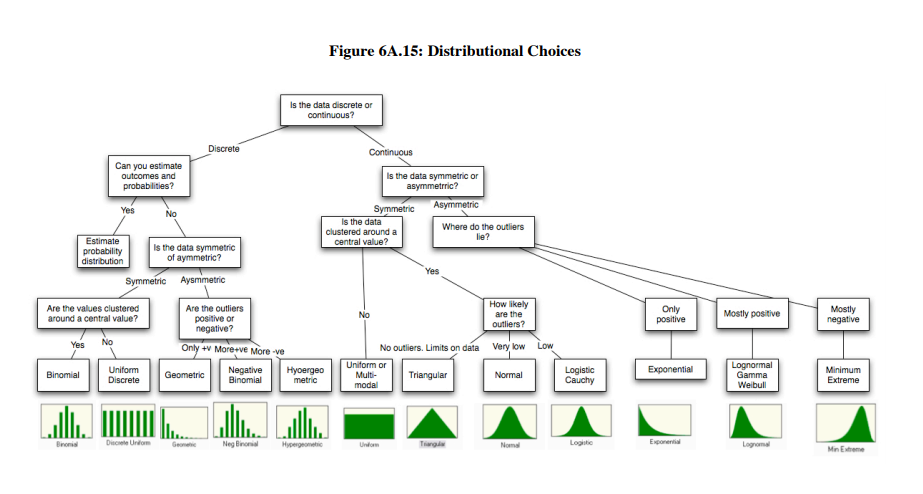

```{r setup, include=FALSE}
knitr::opts_chunk$set(echo = TRUE)
library(dplyr)
library(e1071)
```
## Enunciado

Determinar la distribución de la cantidad de precipitación 
diaria en una localidad geográfica. Como los patrones climáticos varian mes a mes,
los diferentes meses pueden tener diferentes distribuciones de probabilidad.
En particular, los datos de este ejercicio corresponden a la localidad de Gavidia,
en el páramo merideño durante los años 2000 a 2004. Los datos ya han sido procesados
y se encuentren en un data frame con dos columnas M (mes) y P (precipitación).

### Carga de Datos

```{r carga de datos}
datos <-load("PreMensual.RData")
```

Trabajaremos con los datos del mes de Mayo(5), por lo tanto seleccionamos dicho mes.

```{r}
mayo_d <- byMonth %>%
    filter(M==5)
head(mayo_d)

```

Aislamos solo la variable de precipitacion y obtenemos:

```{r}
mayo <- mayo_d$P
mayo
n =length(mayo)
```

### Verificación de la independencia de los datos

##### Gráfico de Autocorrelación:

La primera técnica y la más explicita es el gráfico de autocorrelación
```{r}
acf(mayo)
```

De acuerdo a este gráfico se logro ver que no se muestra correlacion significativa para los retardos, esto representa
un fuerte indicio de que las observaciones son independientes entre sí. Es decir los datos no parecen estar correlacionados serialmente.
Sin embargo veremos que nos dicen las demas técnicas disponibles

##### Gráfico de las observaciones a lo largo del tiempo

Otra técnica es graficar las observaciones a lo largo del tiempo, esto nos mostrará si las observaciones muestran tendencias obvias.

```{r autocor2}
ts.plot(mayo)
```

El gráfico a lo largo del tiempo no parece mostrar tendencias obvias, otro claro indicio de que los datos son independientes.

##### Gráficos de Dispersión

la Última técnica a utilizar serán los gráficos de dispersión para observar las formas descritas por las observaciones, en este caso lo realizamos para 4 separaciones.

```{r}
lag.plot(mayo,lags=4,layout=c(2,2),labels=F,do.lines=F)
```

De nuevo y en concordancia con las gráficas anteriores no vemos correlación en los datos.

###### Análisis: 

De acuerdo con las gráficas anteriores y en especial con el gráfico de correlación se concluye que los datos son independientes.


###  Formulación de una distribución probable

#####  Histograma de Probabilidad

El histograma nos dará un idea de la forma de la distribución.

```{r hipotesis 1}
hist(mayo,prob=T)
lines(density(mayo))
```

De acuerdo con el histograma presentado, notamos que los datos parecen seguir la forma de una distribución Gamma o Weibull, sin embargo utilizaremos las estadísticas sobre los datos ya que algunas distribuciones se caracterizan al menos parcialmente por funciones de sus parámetros 

##### Resumen de estadísticas
```{r hipotesis 2}
summary(mayo)
```

##### Varianza
```{r hipotesis 3}
var(mayo)
```

##### Coeficiente de variación
```{r hipotesis 4}
cvar = sd(mayo)/mean(mayo)
cvar
```

##### Sesgo
```{r hipotesis 5}
skewness(mayo)
```

Tanto el Coeficiente de variación (cv > 1) y el sesgo (v > 0) siguen la hipótesis formulada a partir de la forma del histograma, los datos parecen seguir una de las dos distribuciones, Gamma o Weibull.
ya que cv > 1 es probable que el valor de alfa sea menor a 1 en caso de las distribuciones Gamma o Weibull.
Un Gráfico de caja nos ayuda a afianzar aun mas las hipótesis planteadas. 

```{r hipotesis 6}
boxplot(mayo)
```

###### Análisis: 
Con los valores estadísticos presentados en este inciso vemos que las dos fuertes candidatas son la distribución gamma y la distribución weibull, de acuerdo con este criterio ambas pueden representar de buena forma los datos. 

### Cálculo de los parámetros para la distribución candidata.

Calculamos los parámetros para las distribuciones candidatas: Gamma y Weibull.
```{r}
library(MASS)
gamma.par = fitdistr(mayo,"gamma")
gamma.par
w.par = fitdistr(mayo,"weibull")
w.par
```

### Comparación Gráfica

Comparemos graficamente las funciones de probabilidad acumulada de las distribuciones con la función de probabilidad empírica de los datos:

```{r}
par(mfrow=c(1,2))
curve(pgamma(x,shape=gamma.par$estimate[1],rate=gamma.par$estimate[2]),from=0, to=20,ylab="Probabilidad acumulada",col="red",lwd=2, main="Gamma")
lines(ecdf(mayo))

curve(pweibull(x,shape=w.par$estimate[1],scale=w.par$estimate[2]),from=0, to=20,ylab="Probabilidad acumulada",col="blue",lwd=2, main="Weibull")
lines(ecdf(mayo))
```

Ambos gráficos lucen prácticamente igual, con esto no podemos tomar ninguna de las dos posibles candidatas ya que hasta ahora las pruebas realizadas muestran que podría ser cualquiera de las dos, por esto observaremos los gráficos cuantil-cuantil antes de dar una hipótesis final.

```{r}
par(mfrow=c(1,2))
qqplot(qgamma(ppoints(500), shape=gamma.par$estimate[1],rate=gamma.par$estimate[2]), mayo, main ="Gamma",xlab="cuantiles teóricos",ylab="cuantiles muestrales" )
qqline(mayo, distribution = function(p) 
qgamma(p, shape=gamma.par$estimate[1],rate=gamma.par$estimate[2]),prob = c(0.25, 0.75), col = 2)

qqplot(qweibull(ppoints(500), shape=w.par$estimate[1],scale=w.par$estimate[2]), mayo, main ="Weibull",xlab="cuantiles teóricos",ylab="cuantiles muestrales" )
qqline(mayo, distribution = function(p) 
qweibull(p, shape=w.par$estimate[1],scale=w.par$estimate[2]),prob = c(0.25, 0.75), col = 2)


```

De nuevo ambos gráficos parecen idénticos sin embargo por muy poco vemos como el de la gamma se ajusta ligeramente más a los datos especialmente en el intervalo [20,30] y [60,70] de los cuantiles teóricos.

###### Análisis: 
En este punto a pesar de que los últimos gráficos la gamma se ajusta ligeramente mejor a los datos aparentemente, no descartaremos a la distribucion weibull ya que tambien representa muy bien los datos.

### Pruebas estadísticas de la bondad del ajuste

Realizaremos las Pruebas estadísticas de la bondad del ajuste ya que ellas serán las que nos den el criterio final al escoger alguna de las dos posibles candidatas como modelo para nuestros datos.

#### Chi-cuadrado

##### Cálculo de intervalos

Tendremos que utilizar intervalos que no son equiprobables ya que no existe una formula cerrada para expresar la función de probabilidad acumulada de las distribuciones candidatas (gamma y weibull). Con el fin de definir estos intervalos podemos utilizar el histograma.

```{r}
hist(mayo,plot=F)
```
Debido a que nuestro conjunto de datos tiene la longitud (n) de 80, escogeremos k = 5 intervalos con el fin de tratar de lograr n/k = 16, observaciones por cada intervalo.
Con la información anterior podemos tomar k intervalos de clase donde los limites serán [0, 10], [10, 20], [20, 40], [40, 50] y [50, 60]. Con esto podemos calcular las frecuencias observadas para cada uno de los intervalos.

```{r}
lim = c(0, 10, 20, 40, 50, 60)
k = 5
obs = table(cut(mayo, lim))
obs
```

Sin embargo, vemos como las frecuencias para los intervalos además de ser bastante irregulares no nos da la frecuencia por intervalo mínima recomendada para cada uno, por esto procedemos a modificar manualmente cada intervalo con el fin de logar la frecuencia esperada por cada intervalo.

```{r}
lim = c(0, 1, 3, 7, 12, 60)
k = 5
obs = table(cut(mayo, lim))
obs
```

##### Cálculo de las esperadas

```{r esperadas}
p.gam = numeric(k)
p.w = numeric(k)
for (i in 1:k) {
  p.gam[i] = pgamma(lim[i+1],shape=gamma.par$estimate[1],rate=gamma.par$estimate[2])-pgamma(lim[i],shape=gamma.par$estimate[1],rate=gamma.par$estimate[2])
  p.w[i] = pweibull(lim[i+1],shape=w.par$estimate[1],scale=w.par$estimate[2])-pweibull(lim[i],shape=w.par$estimate[1],scale=w.par$estimate[2])
}
esperada.gam = n*p.gam
esperada.w = n*p.w
```

Una vez calculadas las esperadas podemos proceder a calcular los estadísticos.

##### Cálculo de los estadísticos

```{r estadisticos}
X2_g = sum((obs - esperada.gam)^2/esperada.gam)
X2_g
X2_w = sum((obs - esperada.w)^2/esperada.w)
X2_w
```

##### Cálculo del Valor Crítico.

para ello necesitamos calcular los grados de libertad de nuestro conjunto de datos.

```{r gl}
alfa = 0.1
n.p = 2
gl = length(obs) - n.p - 1 
```

finalmente el valor crítico

```{r critico}
X2_c =qchisq(1-alfa,gl) 
X2_c
```

###### Análisis:

Ninguna de las dos distribuciones puede ser rechazada como un modelo para los datos debido a que X2_w < X2_c y X2_g < X2_c. Sin embargo, ya que X2_w < X2_g se toma como modelo la distribución Weibul.

## Conclusiones finales

### Indicaciones:

1. Algunas referencias interesantes para este tema y el proyecto

  + Gráfico con las distribuciones de probabilidad y sus relaciones https://www.johndcook.com/blog/distribution_chart/
  
  + Grafico de selección de las distribuciones: 
  
  
Fuente: http://people.stern.nyu.edu/adamodar/pdfiles/papers/probabilistic.pdf

2. Distribuciones comunes para modelizar datos de precipitacion son:

  + La exponencial

  + La Gamma

  + La Weibull

  + La Logonormal

Asi que estas deben ser sus principales "sospechosas".

 